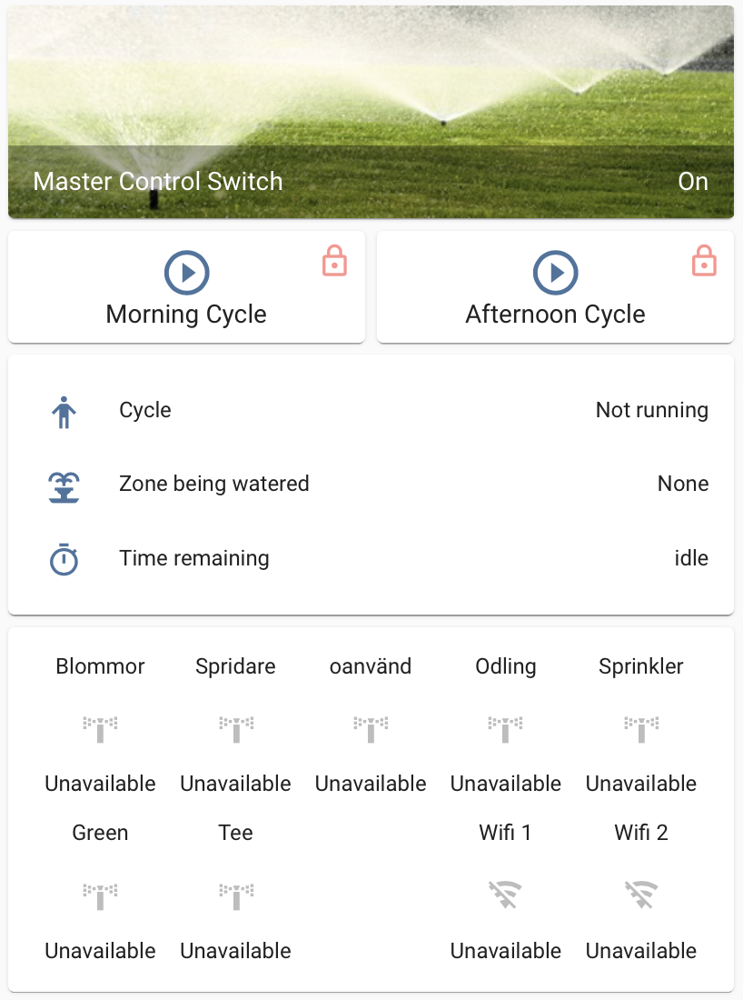
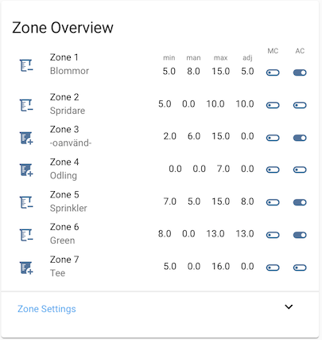
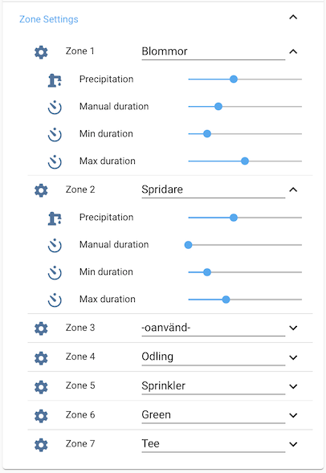
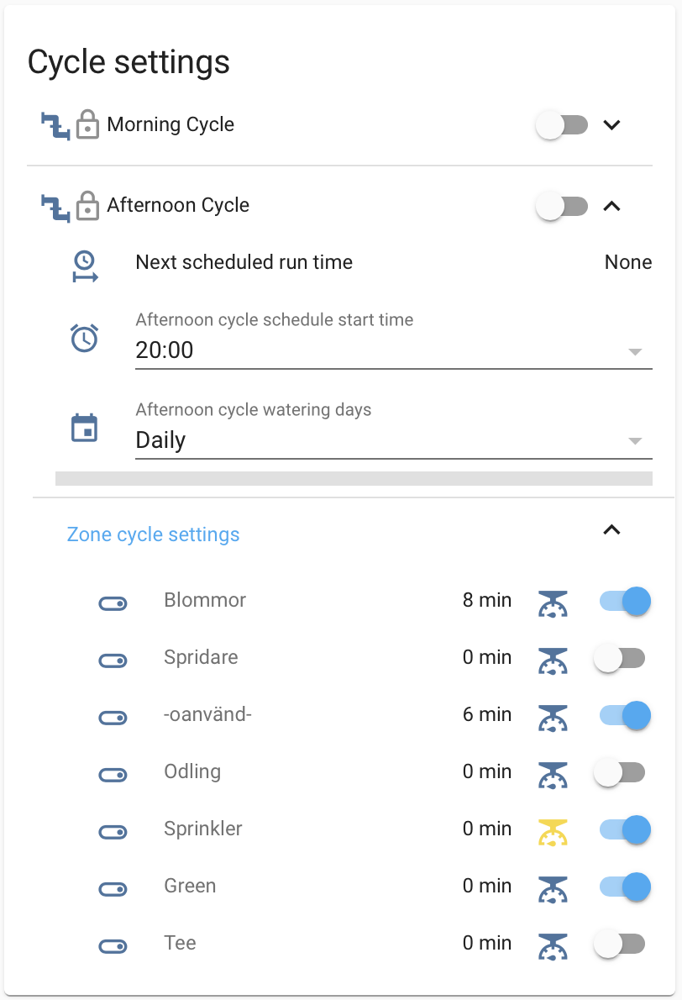
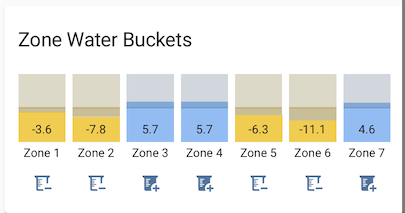

# Weather setup in Home-Assistant
__Adopted from kloggy's excellent work on [HA Irrigation](https://github.com/kloggy/HA-Irrigation-Version1).__

*Note: I make use of HA Irrigation version 1, since that was the version I started with, and with the adoptions I've made it fits my needs so I will not change to version 2 for now.*

[![Buy me a coffee][buymeacoffee-shield]][buymeacoffee]

[buymeacoffee]: https://www.buymeacoffee.com/klec00
[buymeacoffee-shield]: https://www.buymeacoffee.com/assets/img/custom_images/orange_img.png

In short, the system consists of a set of irrigation Zones that can be individually controlled. The irrigation is done using run Cycles, one in the morning and one in the afternoon. The irrigation duration per Zone can be controlled either by a manually specified time, or by an automatic calculation that takes weather conditions into consideration. The latter part is the biggest change I've made compared to the original HA-Irrigation implementation.

*Note: screeshot captured during autumn when system was turned off, therefore zone valves indicate unavailable :-)*

## Irrigation design
One thing I've been building this year is my own green in the garden. Since a green requires quite a lot of TLC, I decided to at least automate my irrigation system to make life easier. My ambitions are pretty low when it comes to the green, but it turned out to be a perfect project to nerd down into the world of greenkeeping.
In total I have three zones for the lawn; backside, front, and the green itself. In addition I have four other zones for plants and flowers.

The base of my Home Assistant solution is the HA Irrigation project by kloggy. I have however adopted it to suit my needs, and I realised I need to document it before I forget how it works (in case I need to fix something).

### Zone setup
Each Zone is defined in a set of input_number helpers. The input_numbers are then templated to individual sensor for better apperance in the user interface.

MC and AC toggles gives a visual indication if the Zone is activated in the Morning Cycle and Afternoon Cycle.

| Helper | Description |
| --- | --- |
|`input_text.zoneX_description`|Friendly name of Zone *X*. Is used to display a more meaningful name in the UI|
|`input_number.zoneX_percipitation_rate`|The percipitation rate of the sprinkler in mm/h. See [https://www.rainbird.com/professionals/irrigation-scheduling-use-et-save-water](https://www.rainbird.com/professionals/irrigation-scheduling-use-et-save-water) for instructions how to calculate|
|`input_number.zoneX_manual_duration`|Time in minutes when Zone *X* is irrigated using manual setting|
|`input_number.zoneX_minimum_duration`|Minimum duration in time that the Adjusted Zone duration should meet for irrigation to occur|
|`input_number.zoneX_maximum_duration`|Maximum allowable time for Adjusted Zone duration|

If the zone irrigation is set to automatic mode, the `zoneX_minimum_duration` and `zoneX_minimum_duration` numbers are used to set the window in which the automated duration calculation needs to operate. If the minimum number is not met, no irrigation will take place. If the maximum number is exceeded, the duration will be set to the maximum. This rule is useful to ensure that i.e. the lawn doesn't get a drip of water every now and then. It is usually better to give it a bigger spray more seldom.

### Cycle Controls
The Irrigation system has two standard runs per day, a morning cycle and an afternoon cycle. The cycles start at set times, and any zone that is tagged to be included in the run will get its fair share of water. In addition, a manual run of a cycle can be triggered, and a manual run of a zone can also be done.

The basic settings for Zone Cycle controls are:
| Variable | Description |
| --- | --- |
|`input_boolean.cycleN_zoneX_irrigation`|Boolean to set if Zone *X* should automatically be included in the run of Cycle *N*|
|`input_boolean.cycleN_zoneX_automatically_adjust_time`|Boolean to set if Zone *X* should use the automatic calculation of irrigation time, or if a static manually set time should be used|
|`input_boolean.cycleN_zoneX_irrigation_duration`|The calculated time Zone *X* should run|

Calculation of `input_number.adjusted_zoneX_duration` in next section.

*Todo: Make it possible to automatically adjust cycle start time based on Sunrise/Sunset*

## Irrigation time calculations
To automatically calculate the adjusted zone durations, the individual run time per zone based on the estimated irrigation need. To estimate this, a Water Bucket (measured in 'mm') is created for each Zone that keeps track of the net water level for the Zone. If the Water Bucket has a negative value, there is a need to add water to the Zone. If the Water Bucket has a positive value, no additional watering is needed. See for instance 

### Water Bucket
Calculating the Zone Water Buckets is done in a set of steps:

- _Midnight:_ After each midnight, the Smart Irrigation sensor `[smart_irrigation_]base_water_bucket` is captured into `input_number.evapotranspiration_daily` to store the base water bucket change from last day. Each individual Zone water bucket is then adjusted with this base value. Smart Irrigation observed rain is stored in `input_number.smart_irrigation_eod_estimated_rain` for the Mid day adjustment
- _Mid day:_ Since the rainfall data from Smart Irrigation is not that precise for the place where I live, I run a second daily update of the water buckets when I get the readings form the SMHI data source `sensor.calculated_average_rain_yesterday`. This data is usually available at 10:00, and because I'm lazy I've set the update to trigger at 11:30. Each water bucket is adjusted with the offset between the SMHI reading and previously stored Smart Irrigation End of Day estimated rain. *Todo: change so that the automation triggers when official data is made available... will require some special checks though...*
- _After irrigation:_ The water buckets are updated after each irrigation with the amount of millimeters that has been added

### Zone Durations
As previously  described, the irrigation duration for a Zone can be either manually set, or calculated automatically. The automatic calculation is calculated every 30 minutes by calling `script.calculate_adjusted_zone_duration`, and it takes into consideration the weather conditions of the day using the following formula:

    Water to add (mm) = (Zone Waterbucket) + 80% of (forecasted rain today) - (irrigation already done today)

Thru testing I found that 80% of forecasted rain gave me a decent result. After the calculation of mm water needed, the script converts millimeters of water to time using the Zone percipitation setting `input_number.zoneX_percipitation_rate` and finally applies the min/max duration constraints (`input_number.zoneX_minimum_duration` and `input_number.zoneX_maximum_duration`).

## Hardware
I started up with a prototype using a NodeMCU ESP8266 board connected to four relays controlling one solenoid each. The setup worked fine as a prototype but wasn't suitable for a more permanent installation.

The size of the solenoids will decide the water flow. I found that the 1/2" version wasn't providing enough flow for my lawn sprinklers, so I had to buy a set of 3/4" valves. The 1/2" are used for the plant bed. I use 9V DC solenoids today since I had one of them laying around when  I started this project. If I'd start over I think I would go for the 24V AC versions instead since they draw less current.

### Irrigation
- 3x Gardena S80 sprinklers
- 4x Simple overground inpulse rotating garden sprinklers
- 4x Gardena microdrip systems for plant and flower irrigation
- 4x 12V DC copper solenoid valve 1/2"
- 3x 12V DC copper solenoid valve 3/4"
- Various pipes and connectors

### Control unit
- 2x Sonoff 4CH Pro v2, flashed with [esphome.io](https://esphome.io)
- 1x MeanWell 12V DC power supply
- 1x Waterproof junction box IP67 

#### esphome
The esphome program has a built in failsafe mechanism which I borrowed from the thread [ESPHOME create a PulseTime like tasmota](https://community.home-assistant.io/t/esphome-create-a-pulsetime-like-tasmota/185274) on the Home Assistant community forum. The failsafe has a hardcoded setting at boot, and is then set before activating a valve by Home Assistant from `input_number.irrigation_failsafe_delay`.

The program also has an interlock defined so that only one valve can operate at a time. This does however only work within the Sonoff device itself. I have two Sonoff controllers so in addition to the controller based failsafe, an additional control is implemented in Home Assistant to ensure only one valve is activated at a time.

*todo:*
- delete bucket_today
- ta bort todays_evapotranspiration_forecast
- ta bort evapotranspiration_minus0?
- ta bort calculate_hourly_evapo
- ta bort input_number.evapotranspiration_hourly
- tq bort evapotranspiration_last_24h
- ta bort auto:- alias: Irrigation Weather Update weather conditions every hour
- ta bort auto: - alias: Irrigation Weather Data - Collect new and cycle historic weather data
